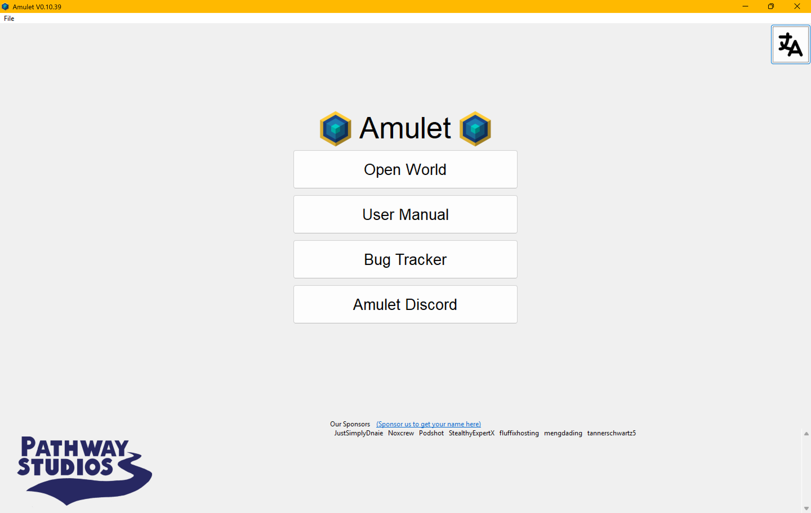
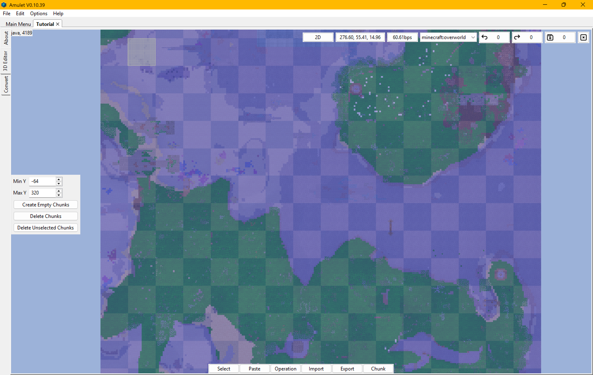
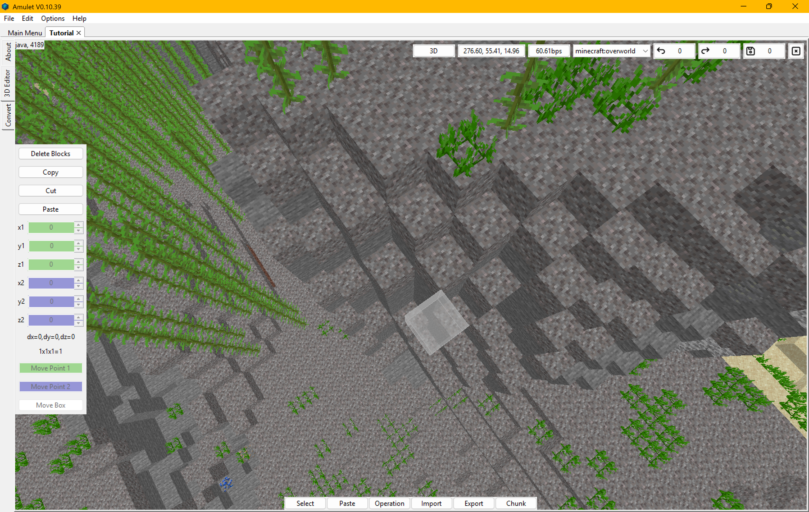
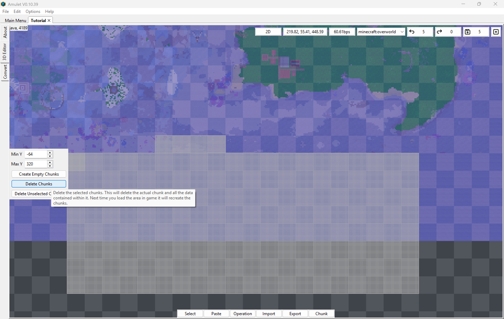
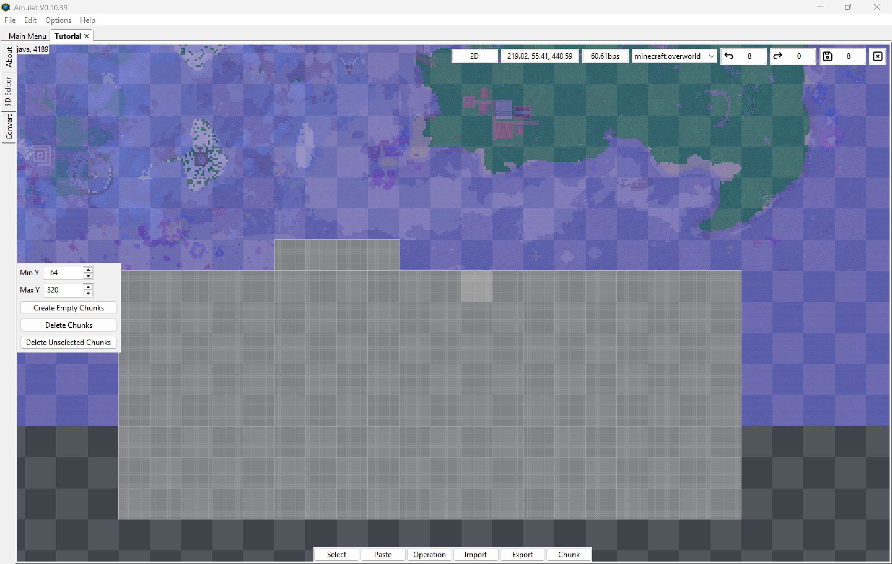

# Placing Chunk by Chunk

As someone who plays minecraft a whole lot, I have played a lot of worlds that meant a lot to me, which is why I use [Amulet Editor](https://www.amuletmc.com/) for editing those worlds and placing chunks in other worlds. Amulet Editor allows for easy and simple world editing, although it sometimes hard to use, and with how the app looks, it makes me want to help make the gui look better.

Chunks are parts of a minecraft region file which defined an areas in a minecraft world, storing data as what type of blocks, mobs, and in storage blocks. Amulet Editor has a viewable map and 3D interfaces which helps users in a famailar and <b>learnable</b> way to edit their worlds. The map viewer is memorable of the in game maps from minecraft, while the 3D interface is quite similar to using the spectar mode in game.

(Here you can see the map and 3D interface

In Amulet it is quite common to just delete or copy chunks from a world, represented by a selected area based off a square 16x16 block area, you can use the shortcuts of Ctrl + C and Ctrl + V to copy and paste chunks as many other programs has these common <b>conventions</b>, or use a button that can paste the chunks in a area. Amulet shows main chunks but also show determined chunks as clear blue areas where placing chunks the it wouldn't cause much of an issue, deleting chunks like shown below is quite simple if you want to get rid of an area or make a new in a space you wish wasn't affected by some desturctive force like a wither or something.

Empty areas are simply none existance chunks or well areas that have been determined by the player reaching that place. So if you place a world in the empty area which the player hasn't, if you place chunks from another world which isn't connected to other areas, the game will simple not load any generation there, you can simply delete those chunks, but it'll not have any generation. This is quite troublesome as it can be an hassle if you have a long time world only for a broken area to appear. You cannot easily <b>recover from the error</b>, meaning before this error you must hope you have a backup of your world so you can recover any data that might have been lost from this error. It is inconvenient for anyone using this program to only get screwed over for trying to place chunks in empty areas that the player.
